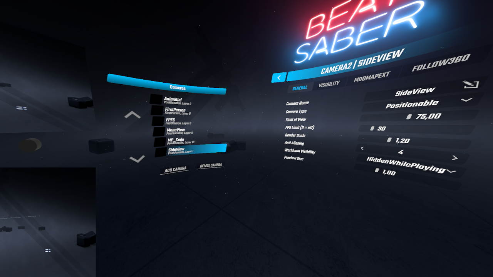

# Camera2

[Camera Plus](https://github.com/Snow1226/CameraPlus) rewritten from scratch with focus on a cleaner, more optimized code base

Please see [**The Wiki**](https://github.com/kinsi55/CS_BeatSaber_Camera2/wiki) for details on how to properly use / configure Camera2

For a "Quickstart guide" that scratches on most of the things that Camera2 can do, see [Fefelands Guide](https://www.youtube.com/watch?v=1ZJFyVqOIrY)!

The Game version(s) specific releases are compatible with are mentioned in the Release title (Its obviously possible latest is not supported assuming its been released recently). If you need the plugin for an older version - Grab an older release that fits 🤯

#### You can always find the latest Download in [the releases](https://github.com/kinsi55/CS_BeatSaber_Camera2/releases)

### New features / improvements (Unless said otherwise, everything configurable per camera)

#### General
- **Support for Replays and FPFC / FPFC toggle out of the box**
- Decent performance improvements, especially on wall maps
- FPS cap (And Global FPS limit when you dont have an HMD connected)
- More options for toggling the visibility of things
	- Walls can be hidden entirely, not just be made transparent (Useful for side cams)
	- **Walls can automagically be made visible if you happen to play a modded map**
	- Hiding Floor(s), Notes, Particles and more
- Every third person camera can follow or ignore the 360 world rotation, its not a special camera type any more

#### First person cameras
- Position smoothing ignores the rotation applied by mod maps so that [fast map rotations are actually watchable](https://www.youtube.com/watch?v=Nt7ZL50dYpI)
- "Force Upright" respects the map rotation, so if a map rotates you upside down your view will be upright in respect to the world rotation

#### Third person cameras
- Can either be always visible / hidden or hidden just while playing
- Ingame preview size customizable

### Changes

#### General
- The implementation of profiles has changed

Where as with Camera Plus you have profiles, and cameras associated to them, you now have scenes and can enable or disable any camera on a per-scene basis. Scenes are the menu, when in game, when watching a replay, etc. More details on scenes can be found [HERE](https://github.com/kinsi55/CS_BeatSaber_Camera2/wiki/Scenes)

#### Third person cameras
- When moving third person cameras the preview gets bigger to give you an easier time positioning correctly.
- Movement scripts
	- The format of movement scripts was changed to more correctly make it represent what it should be - a list of keyframes instead of a list of movements. Camera Plus movement scripts can still be used and will automatically be converted when you try to first use them
	- Map rotations (360 / Mod maps) are added onto the movement script to result in the combined movement
	- You can assign multiple movement scripts to a camera, Camera2 will then always pick a different one at random

### Omitted features (For now™)
- Multiplayer related features
